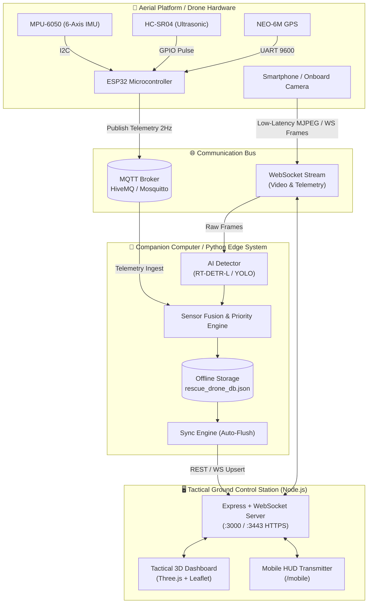

# AEROSIGHT 🛸
### AI-Powered Autonomous Search and Rescue Drone System

[](LICENSE)
[](https://python.org)
[](https://nodejs.org)
[](models/)
[](hardware/)
[](web%20dashboard/)

> **Mission Motto:** *"Faster Detection | Safer Rescue | Stronger Tomorrow"*

**AEROSIGHT** is a next-generation disaster response and autonomous aerial search-and-rescue platform engineered for disaster management agencies (such as NDRF, SDRF, and civil defense forces). It combines **deep learning vision transformers (RT-DETR-L / YOLO)**, an **ESP32 IoT sensor telemetry node**, and a **Three.js-powered 3D Tactical Ground Control Station** to locate survivors and detect secondary hazards in collapsed structures, flood zones, and earthquake rubble.

---

## 📑 Table of Contents

- [Key Features](#-key-features)
- [System Architecture](#-system-architecture)
- [Project Directory Structure](#-project-directory-structure)
- [Hardware & Sensor Node Specification](#-hardware--sensor-node-specification)
- [Prerequisites & Requirements](#-prerequisites--requirements)
- [Quick Start Guide](#-quick-start-guide)
  - [Option A: One-Click Startup (Windows)](#option-a-one-click-startup-windows)
  - [Option B: Manual Step-by-Step Launch](#option-b-manual-step-by-step-launch)
- [Smartphone Drone Camera Mode](#-smartphone-drone-camera-mode)
- [Edge AI & Detection Pipeline](#-edge-ai--detection-pipeline)
- [REST & WebSocket API Reference](#-rest--websocket-api-reference)
- [Hardware Simulation (Wokwi)](#-hardware-simulation-wokwi)
- [Configuration Reference](#-configuration-reference)
- [License & Acknowledgments](#-license--acknowledgments)

---

## 🌟 Key Features

### 1. 🎯 Real-Time Aerial AI Detection
- **RT-DETR-L Vision Transformer**: State-of-the-art real-time detection transformer trained to detect trapped victims and survivors in complex rubble, foliage, and low-contrast debris.
- **Landslide & Secondary Hazard Classification**: Detects rockfalls, structural collapses, and fire/gas hazards.
- **Explainable Priority Scoring Engine**: Ranks discoveries as `CRITICAL`, `HIGH`, or `MEDIUM` based on model confidence, multi-frame persistence, proximity, and obstacle telemetry.
- **Target Georeferencing**: Combines camera pixel bounding boxes with drone altitude, heading, and GPS telemetry to pinpoint real-world rescue GPS coordinates.

### 2. 🛰️ 3D Tactical Ground Control Station (GCS)
- **Interactive 3D Digital Twin Map**: Built with **Three.js** and high-resolution satellite tiles (Google Satellite with automatic ArcGIS fallback) with altitude rendering, waypoint paths, and dynamic drone attitude indicators.
- **2D Tactical Map View**: OpenStreetMap / Leaflet overview for tactical grid mapping and casualty zone distribution.
- **Autonomous Mission Planner**: Design Lawnmower / Grid survey routes, assign flight altitudes, and dispatch automated scanning patterns.
- **Flight HUD Overlay**: Displays artificial horizon, compass heading tape, GPS coordinates, signal quality, and battery reserve in a tactical dark theme.

### 3. 📱 Turn Any Smartphone into a Drone Recon Camera
- **Mobile Camera Transmitter (`/mobile`)**: Mount any smartphone onto a drone frame to stream high-definition video directly to the AI engine.
- **Tactical Mobile HUD**: Real-time compass heading, FPS tracker, flashlight toggle, touch focus, and live detection overlays.
- **Dual Connection Modes**: WebSocket direct camera stream over secure HTTPS (Port 3443) or IP Webcam app integration.

### 4. 📡 Avionics & IoT Sensor Telemetry
- **ESP32 Edge Node**: Gathers orientation from **MPU-6050 (6-axis IMU)**, obstacle clearance from **HC-SR04 (Ultrasonic sensor)**, and satellite coordinates from **NEO-6M GPS**.
- **MQTT Telemetry Stream**: Publishes JSON avionics packets at 2 Hz over MQTT (HiveMQ or local Mosquitto broker).
- **Proximity Collision Avoidance**: Hardware-level proximity warning (< 1.5 m) with status indicators and alerts.

### 5. 💾 Offline-First Resilience & Resilient Synchronization
- **Air-Gapped Operation**: Both the ESP32 hardware and the Python edge system can operate completely isolated from the internet.
- **In-Memory & Local Database Caching**: Circular ring buffer on hardware and local JSON/SQLite storage (`rescue_drone_db.json`) on the edge companion computer.
- **Automatic Sync Manager**: Queues victim sightings and hazard logs when comms are degraded and flushes them in chronological order once the Ground Station link is restored.

### 6. 🚨 Rescue Team Coordination & Export
- **Live Rescue Log**: Dispatch rescue units (*Team Alpha*, *Team Bravo*, *Team Delta*) with estimated time of arrival (ETA) calculation.
- **1-Click Field Export**: Download complete rescue targets as a formatted CSV file (`aerosight_rescue_coordinates_log.csv`) ready for field distribution.

---

## 🏗 System Architecture



---

## 📁 Project Directory Structure

```text
Application/
├── hardware/                      # Embedded IoT Avionics Node (ESP32)
│   ├── diagram.json               # Wokwi simulation circuit layout & wiring
│   ├── esp32_firmware.ino         # ESP32 C++ firmware with circular buffer & MQTT
│   ├── libraries.txt              # Arduino library dependencies for Wokwi
│   ├── README.md                  # Hardware wiring and pinout documentation
│   └── wokwi.toml                 # Wokwi simulation project definition
├── models/                        # Pretrained & Fine-Tuned AI Weights
│   └── rtdetr-l.pt                # Trained RT-DETR-L human detection model (66.5 MB)
├── rescue_drone/                  # Python Edge System & AI Inference Engine
│   ├── ai/
│   │   └── yolo_detector.py       # RT-DETR-L & YOLO inference and bounding-box generator
│   ├── api/
│   │   └── backend.py             # FastAPI diagnostic & simulated discovery endpoints
│   ├── communication/
│   │   ├── mqtt_client.py         # Paho-MQTT subscriber and publisher
│   │   └── websocket_client.py    # Bi-directional WebSocket bridge to GCS
│   ├── config/
│   │   └── config.py              # System settings & environment variable parser
│   ├── database/
│   │   └── database.py            # Local offline JSON/SQLite database manager
│   ├── detection/
│   │   └── victim_manager.py      # Georeferencing, priority scoring & multi-frame confirmation
│   ├── offline/
│   │   └── sync_manager.py        # Offline buffering and retry synchronization worker
│   ├── sensors/
│   │   ├── gps.py                 # GPS coordinate tracking & NMEA parsing
│   │   ├── imu.py                 # IMU attitude calculation (pitch, roll, yaw)
│   │   └── obstacle.py            # Ultrasonic obstacle danger distance evaluator
│   ├── main.py                    # Main autonomous edge system entry point
│   ├── requirements.txt           # Python package requirements
│   ├── rescue_drone.service       # Linux systemd daemon service configuration
│   └── test_pipeline.py           # Comprehensive integration & benchmark test suite
├── web dashboard/                 # Tactical Command Ground Control Station (GCS)
│   ├── public/
│   │   ├── assets/                # Tactical icons, textures, and 3D assets
│   │   ├── css/                   # Tactical dark theme stylesheets
│   │   ├── js/
│   │   │   ├── app.js             # Root application loader & module orchestrator
│   │   │   ├── camera-feed.js     # Low-latency video canvas & HUD drawing
│   │   │   ├── detections.js      # AI detections table, filtering & alerts
│   │   │   ├── map3d.js           # Three.js 3D terrain & satellite drone visualizer
│   │   │   ├── map2d.js           # 2D Leaflet tactical map overlay
│   │   │   ├── mission.js         # Waypoint path planning & autopilot triggers
│   │   │   ├── mobile.js          # Smartphone camera capture & transmitter logic
│   │   │   ├── rescue-log.js      # Search & rescue dispatch coordination
│   │   │   └── telemetry.js       # Real-time avionics telemetry gauges
│   │   ├── index.html             # Main 3D Tactical Command Dashboard SPA
│   │   └── mobile.html            # Dedicated smartphone camera transmitter page
│   ├── ssl/                       # SSL certificate & key for mobile HTTPS access
│   ├── package.json               # GCS Node.js dependencies
│   └── server.js                  # Express backend, WebSocket broker & proxy
├── package.json                   # Root package script runner
├── run_system.bat                 # Windows one-click automated startup script
└── server.js                      # Root entrypoint proxy to web dashboard
```

---

## ⚡ Hardware & Sensor Node Specification

The telemetry node runs on an **ESP32 Dev Module** and collects avionics telemetry to publish over MQTT.

| Component | Pin / Signal | ESP32 GPIO | Description |
|-----------|--------------|------------|-------------|
| **MPU-6050** | VCC / GND | 3V3 / GND | 3.3V Power & Common Ground |
| | SDA | GPIO 21 | I2C Data Line |
| | SCL | GPIO 22 | I2C Clock Line |
| **HC-SR04** | VCC / GND | 5V / GND | Ultrasonic Power & Ground |
| | TRIG | GPIO 5 | 10 µs Ultrasonic Pulse Trigger |
| | ECHO | GPIO 18 | Ultrasonic Return Echo Input |
| **Alert LED** | Anode (+) | GPIO 4 (220Ω) | Lights up when obstacle < 1.5 m |
| **Status LED**| Onboard | GPIO 2 | Blinks on each telemetry broadcast |
| **NEO-6M GPS**| RX / TX | GPIO 17 / 16 | Serial UART Data (9600 baud) |

### Telemetry Packet Schema (MQTT Topic: `rescue/drone/01/telemetry`)
```json
{
  "drone_id": "DRONE_01",
  "timestamp": 1757116800,
  "lat": 10.0234,
  "lon": 78.1234,
  "alt": 120.5,
  "speed": 12.3,
  "heading": 42,
  "battery": 82,
  "status": "IN FLIGHT",
  "obstacle_distance_m": 3.42,
  "imu": {
    "pitch": 1.2,
    "roll": -0.8,
    "yaw": 42.0
  },
  "hazard_detected": null
}
```

---

## 📦 Prerequisites & Requirements

1. **Node.js**: v18.0.0 or higher ([Download Node.js](https://nodejs.org))
2. **Python**: v3.10 to v3.14 ([Download Python](https://www.python.org))
3. **PyTorch**: Compatible with your CPU or NVIDIA CUDA GPU.
4. **Arduino IDE / Wokwi**: For ESP32 firmware deployment or simulation.

---

## 🚀 Quick Start Guide

### Option A: One-Click Startup (Windows)

Simply double-click:
```bat
run_system.bat
```
This automated launcher will:
1. Start the Command Web Dashboard (HTTP port `3000` & HTTPS port `3443`).
2. Verify dashboard endpoint connectivity.
3. Launch the Python Edge AI Engine with the trained RT-DETR-L model.

---

### Option B: Manual Step-by-Step Launch

#### Step 1: Install & Start the Tactical Ground Control Station
```bash
# Navigate to the dashboard directory
cd "web dashboard"

# Install Node.js dependencies
npm install

# Start the command server
npm start
```
*The Command Dashboard is now live at: [http://localhost:3000](http://localhost:3000)*

#### Step 2: Install & Start the Python Edge AI Engine
```bash
# Open a second terminal and navigate to the rescue drone directory
cd rescue_drone

# Install Python requirements
pip install -r requirements.txt

# Run the autonomous drone edge system
python main.py
```

#### Step 3: Access the Applications
- **3D Ground Control Dashboard**: [http://localhost:3000](http://localhost:3000)
- **Mobile Camera Recon Portal**: [https://localhost:3443/mobile](https://localhost:3443/mobile) *(or via local network IP)*
- **Edge API Health & Diagnostics**: [http://localhost:8000/health](http://localhost:8000/health) *(when running FastAPI)*

---

## 📱 Smartphone Drone Camera Mode

AEROSIGHT features a zero-cost drone camera reconnaissance mode using any smartphone.

1. Ensure your smartphone and laptop/ground station are on the **same Wi-Fi network / mobile hotspot**.
2. Open the Command Dashboard ([http://localhost:3000](http://localhost:3000)) and click the **Connect Phone Camera** button, or check the terminal output for the local LAN URL.
3. Open your mobile browser and navigate to:
   ```text
   https://<YOUR_COMPUTER_LOCAL_IP>:3443/mobile
   ```
4. Accept the local SSL certificate prompt, grant camera access, and tap **"Start Drone Recon Feed"**.
5. The smartphone will immediately stream 20+ FPS video to the Python RT-DETR model for live human and hazard detection, with real-time HUD telemetry rendered on screen.

> **Alternative (IP Webcam App):** Install the *IP Webcam* app on Android, tap "Start Server", and paste the stream URL (e.g., `http://192.168.1.15:8080`) into the dashboard under **Live Feed -> Connect IP Camera**.

---

## 🧠 Edge AI & Detection Pipeline

AEROSIGHT incorporates an intelligent multi-stage detection pipeline:

```
Video Stream (Mobile / Drone Cam)
               │
               ▼
   [ RT-DETR-L Transformer ] ──> Person & Victim BBoxes
               │
   [ Landslide Hazard Model ] ──> Rockfall & Collapse BBoxes
               │
               ▼
   [ Sensor Fusion Engine ]
      ├── Drone Altitude & Camera FOV ──> Pixel-to-GPS Projection
      ├── Ultrasonic Proximity Telemetry ──> Hazard Distance Confirmation
      └── Multi-Frame Persistence Filter ──> False-Positive Suppression
               │
               ▼
   [ Explainable Priority Engine ]
      ├── CRITICAL: Confirmed Human + High Proximity / Hazard (<1.5m)
      ├── HIGH: Sustained Detection (>70% confidence across multiple frames)
      └── MEDIUM: Single-frame preliminary visual match
               │
               ▼
   [ Local Offline SQLite/JSON ] ──> [ Ground Station Auto-Sync Engine ]
```

---

## 🔌 REST & WebSocket API Reference

### Ground Station Endpoints (Node.js `:3000`)

| Method | Endpoint | Description |
|--------|----------|-------------|
| `GET` | `/api/telemetry` | Retrieve current drone avionics, position, battery, and flight mode |
| `POST` | `/api/telemetry` | Ingest avionics telemetry from ESP32 MQTT bridge or simulator |
| `GET` | `/api/detections` | Retrieve all detected victims and hazards |
| `POST` | `/api/detections` | Ingest new detection record with coordinates, image, and priority |
| `POST` | `/api/detections/clear` | Purge detection history and rescue logs |
| `POST` | `/api/mission/control` | Send flight commands: `START`, `PAUSE`, `RETURN_HOME`, `EMERGENCY_LAND` |
| `POST` | `/api/mission/assign` | Assign autonomous waypoint survey flight plan |
| `GET` | `/api/rescue-log` | Retrieve rescue team dispatch status log |
| `POST` | `/api/rescue-log` | Create or update rescue dispatch entry |
| `GET` | `/api/rescue-log/csv` | Download rescue coordination log as CSV for field responders |
| `GET` | `/api/network-info` | Discover LAN IPs and smartphone connection URLs |
| `POST` | `/api/ipwebcam/connect` | Connect to an external Android IP Webcam stream |

### Edge Diagnostics Endpoints (FastAPI `:8000`)

| Method | Endpoint | Description |
|--------|----------|-------------|
| `GET` | `/health` | Diagnostic check of GPS, IMU, Sonar, and database metrics |
| `GET` | `/victims` | List stored victims from local offline database |
| `POST` | `/simulate-detection` | Inject a synthetic victim detection for drill exercises |
| `POST` | `/simulate-hazard` | Inject a synthetic landslide hazard for training |

---

## 🔬 Hardware Simulation (Wokwi)

To simulate the ESP32 avionics node without physical hardware:

1. Open [wokwi.com/projects/new/esp32](https://wokwi.com/projects/new/esp32).
2. Copy the contents of [`hardware/esp32_firmware.ino`](file:///f:/SIH_Project/Application/hardware/esp32_firmware.ino) into the **Code** tab.
3. Copy the contents of [`hardware/diagram.json`](file:///f:/SIH_Project/Application/hardware/diagram.json) into the **diagram.json** tab.
4. Add the libraries listed in [`hardware/libraries.txt`](file:///f:/SIH_Project/Application/hardware/libraries.txt) via the **Library Manager**.
5. Click **Start Simulation**.
6. Move the ultrasonic distance slider below 150 cm to watch the Alert LED illuminate and trigger the proximity hazard alert over MQTT.

---

## ⚙️ Configuration Reference

Key parameters can be configured via environment variables or modified directly in [`rescue_drone/config/config.py`](file:///f:/SIH_Project/Application/rescue_drone/config/config.py):

| Variable | Default Value | Description |
|----------|---------------|-------------|
| `DRONE_ID` | `DRONE_01` | Unique identifier for the aerial vehicle |
| `MQTT_BROKER` | `broker.hivemq.com` | MQTT broker hostname (use `localhost` for local Mosquitto) |
| `MQTT_PORT` | `1883` | MQTT broker port |
| `YOLO_CONF_THRESHOLD` | `0.28` | Minimum detection confidence score |
| `YOLO_DEVICE` | `cpu` | Inference accelerator (`cpu`, `cuda`, `mps`) |
| `SIMULATE_AI` | `false` | Run AI in synthetic detection mode without loading weights |
| `DASHBOARD_REST_URL` | `http://localhost:3000` | Command Ground Station base URL |
| `DASHBOARD_WS_URL` | `ws://localhost:3000` | Command Ground Station WebSocket URL |
| `SSL_PORT` | `3443` | Secure HTTPS port for mobile camera access |

---

## 🧪 Testing the Pipeline

A comprehensive test suite is included to benchmark detection rates and pipeline latency:

```bash
cd rescue_drone
python test_pipeline.py
```
This tests:
- Model loading and inference throughput.
- Target georeferencing and GPS calculation accuracy.
- Database write and read performance.
- Offline queuing and synchronization retry logic.

---

## 👥 Team & License

Developed with dedication for the **Smart India Hackathon (SIH)** disaster management and autonomous drone search-and-rescue domain.

- **License**: Released under the [MIT License](LICENSE).
- **Core Mission**: Accelerating first responder reaction times and saving lives through edge artificial intelligence and autonomous robotics.
